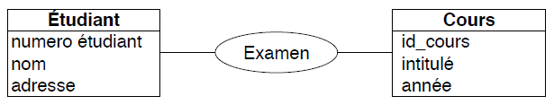
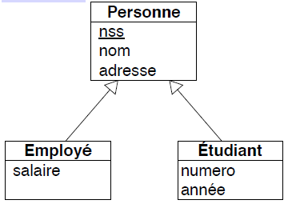

# SQL et Algèbre relationnelle
## Vocabulaire
- Projection $\pi_{condition}(R) \rightarrow$ colonnes de `R` satisfaisant `condition`
    ```sql 
    select
    ```

- Sélection $\sigma_{condition}(R) \rightarrow$ tuples (=lignes) de `R` satisfaisant `condition`
    ```sql
    from
    ```

- Produit cartésien $R \times S \rarr$ disjonction des cas
    ```sql
    ,
    ```

- Renommage $\rho_{B \larr A}(R) \rarr$  `R.A` devient `R.B`
    ```sql
    as
    ```

- Jointure $S \Join_{condition} R$ *ou* jointure naturelle $S \Join R \rarr$ produit cartésien suivi d'une condition de sélection (définissable avec $\pi, \sigma, \times$)
    ```sql
    natural join
    ```

- Différence $R-S \rarr$ enlève les colonnes `S` de `R`
    ```sql
    not in
    not exists
    except
    ```

- Union $R \cup S \rarr$ ou logique
    ```sql
    or
    ```

- Intersection $R \cap S \rarr$ et logique
    ```sql
    and
    ```

- Division $R \div S \rarr$ *pas très utilisé*

## Interaction de l'algèbre relationnelle
- $\pi_A(R \cup S)=\pi_A(R) \cup \pi_A(S)$
- $\sigma_{cond}(R \cup S)=\sigma_{cond}(R) \cup \sigma_{cond}(S)$
- $(R \cup S) \times T=(R \times T) \cup (S \times T)$;
- $T \times (R \cup S)=(T \times R) \cup (T \times S)$;
- $A \sube B \iff$ `not exists (A except B)`
- $A=B \iff (A \sube B) \wedge (B \sube A)$

## Exemples de requête
### Requête de base
- Trouver les réalisateurs qui ont joué dans leurs propres films : 
    - $\pi_{realisateur}(\sigma_{realisateur=acteur}(Film))$

    ```sql
    select realisateur from Film where realisateur=acteur;
    ```

- Trouver les cinémas qui projettent des films de Polanski : 
    - $\pi_{cinema}(\sigma_{realisateur='Polanski'}(\sigma_{Film.titre=Seance.titre}(Film \times Seance)))$
    - $\pi_{cinema}(\sigma_{realisateur='Polanski' \wedge Film.titre=Seance.titre}(Film \times Seance)))$

    ```sql
    select Seance.cinema from Film, Seance where realisateur='Polanski' and Film.titre=Seance.titre;
    ```

    - Avec la jointure naturelle : 
    $\pi_{cinema}(\sigma_{realisateur='Polanski'}(Film \Join Seance))$

    ```sql
    select Seance.cinema from Film natural join Seance where realisateur='Polanski';
    ```

    - Avec requêtes imbriquées :
    
    ```sql
    select cinema from Seance where Seance.titre in
        (select Film.titre from Film where realisateur='Polanski');
    ```

### Requête imbriquée
- Trouver les films qui partagent le même réalisateur et au moins un acteur avec Chinatown :
    - $\pi_{F2.titre}(\sigma_{F1.realisateur=F2.realisateur \wedge F1.acteur=F2.acteur}(\sigma_{F1.titre='Chinatown'}(F1) \times F2))$

    ```sql
    select titre from Film where (realisateur, acteur) in 
        (select realisateur, acteur from Film where titre='Chinatown');
    ```

    $\iff$
    
    ```sql
    select F1.titre from Film F1, Film F2 where F2.titre='Chinatown' and F1.realisateur=F2.realisateur and F1.acteur=F2.acteur;
    ```

### Requête avec disjonction
- Trouver des acteurs qui ont joué dans des films de Kubrick ou de Polanski :
    - $\pi_{acteur}(\sigma_{realisateur='Kubrick'}(Film)) \cup \pi_{acteur}(\sigma_{realisateur='Polanski'}(Film))$
    
    ```sql
    select acteur from Film where realisateur='Kubrick' UNION select acteur from Film where realisateur='Polanski';
    ```

    $\iff$
    
    ```sql
    select acteur from Film where realisateur='Kubrick' or realisateur='Polanski';
    ```

### Requête avec intersection
- Trouver tous les acteurs qui sont aussi réalisateurs :
    - $\pi_{personne}(\rho_{personne \larr acteur}(Film)) \cap \rho_{personne \larr realisateur}(Film))$

     ```sql
    select acteur as personne from Film intersect
        (select realisateur as personne from Film);
    ```

    $\iff$

    ```sql
    select acteur as personne from Film in
        (select realisateur as personne from Film);
    ```

### Requête `in` et `not in`
- Les films dans lesquels Deneuve ne joue pas :
    - $\pi_{titre}(Film)-\pi_{titre}(\sigma_{acteur='Deneuve}(Film))$

    ```sql
    select titre from Film where titre not in 
        (select titre from Film where acteur='Deneuve');
    ```

- Les films dans lesquels Deneuve n'est pas la seule personne à jouer :
    - $\pi_{titre}(Film)-\sigma_{acteur='Deneuve'}(Film)$

    ```sql
    select titre from Film where acteur not in 
        (select acteur from Film where acteur='Deneuve');
    ```

    - $\pi_{titre}(\sigma_{acteur\ne'Deneuve'}(Film))$

    ```sql
    select titre from Film where acteur<>'Deneuve';
    ```

- Les films dans lesquels ne joue que Deneuve :
    - $\pi_{titre}(Film)-\pi_{titre}(\sigma_{acteur\ne'Deneuve'}(Film))$

    ```sql
    select titre from Film where titre not in
        (select titre from Film where acteur<>'Deneuve');
    ```

### Requête `exists` et `not exists`
- Les films qui passent dans un cinéma :
    - $\pi_{titre}(Film \Join Seance)$

    ```sql
    select titre from Film where exists
        (select * from Seance where Film.titre=Seance.titre);
    ```

    $\iff$

    ```sql
    select Film.titre from Film, Seance where Film.titre=Seance.titre;
    ```

- Les films qui ne passent dans aucun cinéma : 
    - $\pi_{titre}(Film)-\pi_{titre}(Seance \Join Film)$

    ```sql
    select Film.titre from Film where not exists
        (select * from Seance where Film.titre=Seance.titre);
    ```

    - $\pi_{titre}(Film)-\pi_{titre}(Seance)$

     ```sql
    select titre from Film where titre not in
        (select titre from Seance);
    ```

- Trouver les réalisateurs dont les films passent dans tous les cinémas :
    - $\pi_{realisateur}(F)-\pi_{realisateur}((\pi_{cinema}(S) \times \pi_{realisateur}(F))-\pi_{cinema, realisateur}(F \Join S))$
    
    ```sql
    select F1.realisateur from Film F1 where not exists 
        (select S.cinema from Seance S where not exists 
            (select F2.realisateur from Film F2 where F2.titre=S.titre and F1.realisateur=F2.realisateur));
    ```

- Les cinémas qui ne passent aucun film de Polanski :
    - $\pi_{cinema}(Seance)-\pi_{cinema}(\sigma_{realisateur<>'Polanski'}(Film) \Join Seance)$

    ```sql
    select cinema from Seance where not exists
        (select * from Film where Seance.titre=Film.titre and realisateur='Polanski');
    ```

- Les réalisateurs dont les films passent dans tous les cinémas (au moins un film dans chaque cinéma) :
    - $\pi_{realisateur}(F)-\pi_{realisateur}((\pi_{cinema}(S) \times \pi_{realisateur}(F))-\pi_{cinema, realisateur}(F \Join S))$

    ```sql
    select F.realisateur from Film F where not exists
        (select S.cinema from Seance S except
            (select S1.cinema from Seance S1, Film F1 where S1.titre=F1.titre and F1.realisateur=F.realisateur));
    ```

    - $\pi_{cinema, realisateur}(Seance \Join Film) \div \pi_{cinema}(Seance)$

### Requête `except`
- Trouver tous les acteurs qui ne sont pas des réalisateurs :
    - $\pi_{personne}(\rho_{personne \larr acteur}(Film)) - \rho_{personne \larr realisateur}(Film))$

     ```sql
    select acteur as personne from Film except
        (select realisateur as personne from Film);
    ```

    $\iff$

    ```sql
    select acteur as personne from Film not in
        (select realisateur as personne from Film);
    ```


# SQL : DDL (Data Definition Langage) et DML (Data Modification Language)
## Création de schémas de BD
### Création d'une table
```sql
create database ma_base(
    titre varchar(30),
    annee integer,
    realisateur varchar(30)
);
```

### Types d'attributs SQL courants
- `bool` : boolean
- `int` : entier signé sur 4 octets
- `real` : réel
- `numeric(precision, echelle)` : décimaux où `echelle` est le nombre de chiffres après la virgule, et `precision` le nombre de chiffres totaux
- `text` : chaîne de caractères
- `char(n)` : chaîne d'au plus `n` caractères
- `serial` : entier à incrémentation automatique (pratique pour les identifiants internes)
- `date` : date au format année-mois-jour
- `time` : heure au format heure-minute-seconde
- `timestamp` : combine date et heure
- `year` : stocke une année

## Contraintes d'intégrité
### Contrainte `not null`
```sql
create table Film(titre varchar(30) not null);
```

### Contraintes de clé
- Une table a toujours *au moins* une clé primaire, qui est forcément `not null`

```sql
create table Film(titre varchar(30) primary key);

create table Batiment(
    ville varchar(50),
    rue varchar(100),
    numero integer,
    #etages integer,
    primary key(ville, rue, numero)
);
```

- Les autres sont des clés candidates (ou secondaires), et ne sont pas forcément `not null`

```sql
create table Personne(
    nss varchar(20) primary key,
    nom varchar(50) not null,
    prenom varchar(50) not null,
    naissance integer,
    unique(nom, prenom, naissance)
);
```

- Les clés étrangères servent à relier des tables, et sont **clés primaires** de leur table
    
<ins>Exemple</ins> : Personne[pays] $\sube$ Pays[code]

```sql
create table Pays(
    code varchar(4) primary key,
    nom varchar(50)
);

create table Personne(
    nss varchar(20) primary key,
    pays varchar(4),
    foreign key(pays) references Pays(code)
);
```

<ins>Remarque</ins> : `foreign key(pays) references Pays(code)` peut aussi s'écrire `foreign key(pays) references Pays`

- Les attributs reliés doivent être **clés candidates** de leur table

```sql
create table Pays(
    code varchar(4) primary key,
    nom varchar(50) unique
);

create table Personne(
    nss varchar(20) primary key,
    pays varchar(50),
    pays references Pays(nom)
);
```

### Contraintes génériques :
- contraintes sur une seule table : `check`

```sql
create table Article(
    id integer primary key,
    prix numeric not null,
    prix_solde numeric,
    check(prix>prix_solde)
);
```

<ins>Remarque</ins> : il est possible de nommer une contrainte avec `constraint`

```sql
create table Produits(
    prod_nb integer primary key,
    prix numeric constraint prix_positif check(prix>0)
);
```

- contraintes sur plusieurs tables : `assertions SQL`

## Détruire une table
- Supprimer le schéma et les données
```sql
drop table Films;
```

- Supprimer toutes les données, mais garder la table
```sql
truncate table Films;
```

## Modifier une table
- Renommer une table
```sql
alter table Films rename to Movies;
```

- Renommer une colonne
```sql
alter table Movies rename column titre to title;
```

- Ajouter et supprimer une contrainte `not null`
```sql
alter table produits alter column prix set not null;

alter table Produits alter column prix drop not null;
```

- Ajouter une contrainte de clé étrangère
```sql
alter table Reservation add constraint nomfk foreign key(nom) references Personne(nom);
```

- Ajouter une clé primaire générée de façon automatique (ssi il n'y en avait pas déjà une)
```sql
alter table Films add primary key(id_film);
```

- Ajouter, supprimer et renommer une contraite `check`
```sql
alter table Produits add constraint prix_positif check(prix>0);

alter table Produits drop constraint prix_positif;

alter table Produits rename constraint prix_positif to prix_sup_zero;
```

## Manipulation de données (DML)
### Insertion de données
```sql
insert into Films values('Your Name.', 2016, 'Shinkai Makoto');

insert into Films (realisateur, titre) values('Shinkai Makoto', 'Your Name.');

insert into FournisseursParisiens (select * from Fournisseur where Ville='Paris');
```

<ins>Remarques</ins> :
- On peut ne saisir que quelques attributs, dans un ordre qu'on choisit (cf. deuxième exemple)
- Si la valeur d'un attribut n'est pas spécifiée pendant l'insertion, alors `null` lui sera affectée
- Une clause `default` peut être spécifiée, et sera donnée à la place de `null`
    ```sql
    create table Notation(note integer not null default 0);
    ```

### Modification de données
```sql
update Employe
set salaire=salaire*1.1,
    prime=prime+150
where sexe='F';
```

### Suppression de données
```sql
delete from Films where annee<=1960;

delete from Seance where titre in
    (select titre from Film where realisateur='Polanski');
```

<ins>Remarque</ins> : 
`delete from Films;` est équivalent à `truncate Films;` mais est moins efficace

### Maintien de l'intégrité référentielle
- Par défaut, le système n'applique pas les modifications violant les contraintes d'intégrité (`restrict`)
- En cascade, les modifications sur l'attribut référencé s'applique aussi sur la référence

    ```sql
    drop table Seance on delete cascade;
    ```

- Avec `set null`, les modifications sur l'attribut référencé sont répercutées sur la référence, en mettant sa valeur à `null`
- Avec `set default`, les modifications de l'attribut référencé mettent la référence à la valeur par défaut, s'il en existe une

```sql
create table Seance(
    id_seance serial primary key,
    titre varchar(30), foreign key references Film(titre),
    cinema varchar(30),
    on delete set null,
    on update cascade
);
```


# Modélisation conceptuelle et modèle Entité/Association (E/R)
## Définitions
- Une **entité** est une classe d'objets avec des attributs communs
    |Etudiant|
    |:-:|
    |numéro étudiant<br>nom<br>adresse|

- Une **association** représente un lien entre deux ou plusieurs entités
    ||
    |:-:|
    ||
    |*ou*|
    ||

- Un **attribut d'association** décrit une propriété des instances de l'association
    |Chaque examen a une date|
    |:-:|
    ||
    |*ou*|
    ||
    |*ou*|
    ||

- Une **association réflexive** relie une entité à elle-même

    

- Une **association n-aires** relie plus que deux entités
    
    

## Contraintes
### Contraintes de cardinalité
- Cas **basique** :
    - Une même étudiant ne peut être inscrit qu'à une unique université (`min`=1, `max`=1)
    - Une université peut avoir entre `0` et `n` étudiants (`min`=0, `max`=$\infin$)

    

- Cas **n-aires**
    - Un livre est associé à 0 ou plusieurs couples langue-traducteur
    - Une langue est assoié à 0 ou plusieurs couples livre-traducteur
    - Un traducteur est associé à 1 ou plusieurs couples livre-langue

    

- Cas **n-aires avec intégrité fonctionnelle**
    - Avec la flèche en plus, un couple livre-langue correspond au plus à 1 traducteur
    
    

### Contraintes d'identification (clés)
- Une **superclé** d'une entité est un ensemble d'**un ou plusieurs attributs** tel qu'il n'existe pas deux instances avec les mêmes valeurs pour ces attributs

- Une **clé** (ou **clé candidate**) d'une entité est une superclé minimale

- Plusieurs clés candidates peuvent exister pour une entité, mais pour chaque entité, seulement une est choisie comme **clé primaire**

### Entités faibles
Une entité faible est identifiée par
- un ensemble d'attributs internes appelés **discriminant**
- un ensemble d'entités appelées **entités identifiantes**
    - Chaque entité identifiante doit être reliée à l'entité faible par une association binaire appelée **association identifiante**, de cardinalité `1-1`


### Spécialisation
- Spécialisation (aussi appelée ISA) $\iff$ **héritage** des classes d'objets

    

- Spécialisation **disjointe**
    - L'intersection des instances est **vide**

    

- Spécialisation **totale**
    - L'union des instances renvoie à la classe mère

    

- Spécialisation **disjointe totale**

    

## Passage au modèle relationnel
### Restructuration du diagramme E/R
Les spécialisations ne peuvent pas être traduites directement dans le modèle relationnel :
1. Eliminer l'entité mère
    - Possible uniquement si la **spécialisation est totale**
    - A préférer si l'entité mère
        - a peu d'attributs
        - participe à peu d'associations
        - est peu accédée
    - Implique le dédoublement des associations de la mère

    |Avant||Après|
    |:-:|:-:|:-:|
    |<br>*ou*<br>|$\rarr$||
    ||$\rarr$||

2. Eliminer les entités filles
    - A préférer si les entités filles
        - ont peu d'attributs
        - participent à peu d'associations
        - sont peu accédées
    - Implique des valeurs non-significatives pour les attributs non-concernés
    - Implique le report des associations des filles vers la mère

    |Avant||Après|
    |:-:|:-:|:-:|
    |<br>*ou*<br>|$\rarr$|<br>`type` de valeur `E1` ou `E2`|
    ||$\rarr$||

3. Maintenir toutes les entités, et simuler la spécialisation avec des associations
    - Si spécialisation totale, chaque instance de E participe à R1 ou à R2
    - Si spécialisation disjointe, aucune instance de E ne participe à la fois à R1 et à R2

    |Avant||Après|
    |:-:|:-:|:-:|
    |<br>*ou*<br>|$\rarr$|

### Traduction dans un schéma relationnel
- Chaque entité est traduite en un schéma de relation
    
    

- Chaque association est traduite en 
    - un schéma de relation
    - des contraintes de clés étrangère

    
    <p align="center"><em>Association plusieurs à plusieurs</em></p>
    
    
    <p align="center"><em>Association un à plusieurs</em></p>
    
    
    <p align="center"><em>Association identifiante un à plusieurs</em></p>
    
    
    <p align="center"><em>Association n-aires</em></p>

    - si pas de flèche vers `Traducteur`, alors `id-traducteur` est aussi une clé

- D'autres contraintes du schéma relationnel peuvent être déduites des contraintes de cardinalité du diagramme E/R
- Les contraintes externes plus complexes du diagramme E/R sont traduites par des assertions ou conditions de `check`


# SQL avancé et agrégation
## Conservation des doublons
- Union $\rarr$ `union all`
    ```sql
    select * from S
        union all
    select * from T;
    ```

- Intersection $\rarr$ `intersect all`
- Différence $\rarr$ `except all`

## Pièges de l'ensemble vide
- Si l'ensemble `T` est vide, alors `R` $\times$ `S` $\times$ `T` est vide aussi
    - $\rarr$ préférer
    ```sql
    (select R.A from R, S where R.A=S.A)
        union
    (select R.A from R, T where R.A=T.A)
    ```

## Expressions dans les requêtes
- On peut utliser des expressions dans les clauses `where` et `select`
    ```sql
    select nom, prix-prix_solde
    from Article
    where prix-prix_solde>30
    ```

## Fonctions et opérateurs prédéfinis
- `abs(num)` : valeur absolue
- `ceiling(num)` : partie entière supérieure
- `floor(num)` : partie entière inférieure
- `position(sub in string)` : position de `sub` dans `string`
- `length(str)` : longueur de `str`
- `substring(chaine [from int] [to int])`
- `str1 || str2` : concaténation des chaînes
    ```sql
    select 'réalisateur : ' || nom from Artistes;
    ```

- `now()` : date et heure courantes
- `current_date` : date courante
- `current_time` : heure courante

## Ordonner la réponse avec `order by`
- Ordre croissant
```sql
select * from S order by A3;
```

- Ordre décroissant
```sql
select * from S order by A3 desc;
```

- Ordre sur plusieurs attributs
```sql
select * from S order by A1, A3;
```

- Trier avec des opérations
```sql
select A3 from R order by A1+A2;
```

## Comparaisons avec `like`
- `_` représente n'importe quelle lettre
- `%` représente n'importe quelle sous-chaîne (dont $\varnothing$)

## Requêtes d'agrégat simple
- `min` et `max` s'appliquent aussi aux chaînes de caractères (ordre lexico)
- `sum` additionne tous les éléments d'une colonne
- `sum distinct` additionne tous les éléments distincts d'une colonne
- `count` compte les éléments d'une colonne
- `count distinct` compte les éléments distincts d'une colonne

## Agrégation et `group by`
- La durée moyenne des films par réalisateur :
```sql
select realisateur, avg(duree)
from Film
group by realisateur;
```

## Sélections sur les résultats d'agrégation avec `having`
- $\rarr$ `having` filtre les groupes
- Le temps moyen des films d'un réalisateur, si et seulement s'il a réalisé au moins un film de plus de 90 minutes :
```sql
select realisateur, avg(duree)::real
from Film
group by realisateur
having max(duree)>90;
```

- Le réalisateur qui a tourné le plus de films :
```sql
select realisateur, count(distinct titre)
from Film
group by realisateur
having count(distinct titre)>=all(select count(distinct titre)
                                  from Film
                                  group by realisateur);
```

## Agrégation et jointures
- Pour tout cinéma montrant au moins un film de plus de 90 minutes, afficher la durrée moyenne des films qui y passent :
```sql
select S.cinema, avg(cast(F.duree as real))
from Seance S natural join Film F
group by S.cinema
having max(F.duree)>90;
```

## Agrégation dans `where`
- Les films qui sont plus longs que tous ceux qui passent actuellement au cinéma :
```sql
select F.titre
from Film F
where F.duree>(select max(F1.duree)
               from Film F1, Seance S
               where F1.titre=S.titre);
```

```sql
select F.titre
from Film F
where F.duree>all(select F1.duree
                  from Film F1, Seance S
                  where F1.titre=S.titre);
```

- Les films qui sont plus courts qu'au moins un film qui passe actuellement au cinéma :
```sql
select F.titre
from Film F
where F.duree<(select max(F1.duree)
               from Film F1, Seance S
               where F1.titre=S.titre);
```

```sql
select F.titre
from Film F
where F.duree<any(select F1.duree
                  from Film F1, Seance S
                  where F1.titre=S.titre);
```

- Les films dont la durée correspond au moins à 10% de la longueur totale de tous les autres films combinés :
```sql
select F.titre
from Film F
where F.duree>=0.1*(select sum(F1.duree)
                    from Film F1
                    where F1.titre<>F.titre);
```

## Sous requête dans le `from`
- Trouver le nombre de films maximum projeté par cinéma
```sql
select max(nbre)
from (select count(distinct titre) as nbre
      from Film natural join Seance
      group by cinema) as S;
```

- Calculer la moyenne des durées maximales des films réalisés par chaque réalisateur 
```sql
select avg(duree)
from (select max(duree) as duree
      from Film
      group by realisateur) as foo;
```


<ins>Remarque</ins> : il est obligé de donner un nom à la sous requête dans le `from`

## Conditions de totalité avec les agrégats
- Les cinémas qui passent tous les films
```sql
select distinct S.cinema from Seance S
where not exists(
    select F1.titre from Film F1
    where F1.titre not in(
        select F2.titre 
        from Film F2 natural join Seance S2
        where S2.cinema=S.cinema
    )
);
```

```sql
select cinema from Seance
group by cinema
having count(distinct titre)
=
(select count(distinct titre) from Film);
```


# Information incomplète dans SQL
## Valeur `NULL` et opérations
- Toute opération arithmétique mettant en jeu un `NULL` à pour résultat `NULL`
    - `1+NULL` $\rarr$ `NULL`
    - `1-NULL` $\rarr$ `NULL`
    - `1*NULL` $\rarr$ `NULL`
    - `1/NULL` $\rarr$ `NULL`
    - `NULL/0` $\rarr$ `NULL`
- Les opérateurs d'agrégation ignorent les `NULL`
    - mais exception pour `count(*)`
- Le calcul d'un agrégat sur un multi-ensemble vide retourne `NULL` (ou `0` pour `count`)
- Dans les opérations ensemblistes, les `NULL` sont traités comme n'importe quelle autre valeur
- Le résultat des requêtes avec conditions de sélection (`where R.A=S.A`) est vide


## Eviter les pièges de la valeur `NULL`
- Vérifier si la valeur est nulle ou pas avec `is null`, et non `=null`
- `coalesce` retourne le premier de ses arguments non `NULL`
```sql
select nom, (prix-coalesce(reduction, 0)) as prix_net
from Article;
```

- `case` de même
```sql
select nom, (prix-case
    when reduction is null then 0
    else reduction
    end) as prix_net
from Article;
```

## Jointures externes
- `natural left outer join` : lors de la jointure, les tuples qui n'ont pas de correspondant sont complétés avec `NULL` à droite (on garde la valeur de gauche)
- `natural right outer join` : idem, mais on garde la valeur de droite, et complète celle de gauche par `NULL`
- `natural full outer join` garde tous les tuples possibles (union des résultats de `right` et `left`)


# Vues, tables temporaires et requêtes récursives
## Vues
- Une vue fournit un mécanisme pour cacher ou restructurer les données accessibles à certains utilisateurs
```sql
create view nom_vue as <requete>;

select * from nom_vue;
```

- La mise à jour des vues n'est possible que sur des vues simples, donc pas
    - de jointure
    - d'opération ensembliste
    - d'agrégation
    - de requête récursive
    - $\rarr$ màj ambiguës

## Tables temporaires
```sql
with nom_table as <requete>
select * from nom_table;
```

## Requêtes récursives
- Forme générale de la requête du `as` :
    - terme non récursif
    - `union` ou `union all`
    - **terme récursif** pouvant contenir une référence au résultat de la requête elle même
    - `limit` pour ne pas avoir de résultats infinis avec `union all`
    ```sql
    with recursive R(attribut_1, ..., attribut_n) as(
        requete_de_base(sans R)
        union [all]
        requete_recursive(avec R)
    )
    requete_avec_R(et autres tables)
    limit 1000;
    ```

- <ins>Remarque</ins> : ne pas utiliser `not in`, `except` et `not exists` dans la partie récursive

- Trouver tous les prérequis d'un cours
```sql
with recursive c_prereq(id_cours, id_prereq) as(
    select id_cours, id_prereq from prereq
    union
    select prereq.prereq_id, c_prereq.id_cours
    from prereq, c_prereq
    where prereq.id_cours=c_prereq.id_prereq
)
select * from c_prereq;
```

- Calculer la somme des n premiers entiers
```sql
with recursive t(n) as(
    values(1)
    union
    select n+1 from t where n<100
)
select sum(n) from t;
```