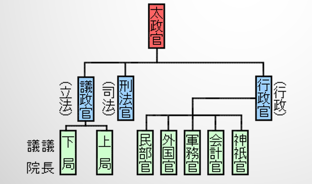

# **Chapitre 1** – Histoire moderne et contemporaine du droit japonais
## **I.** La modernisation des institutions politiques et du droit sous Meiji
#### <ins>L'ouverture forcée du Japon (開国)</ins> :
- Commodore Perry débarque en **juillet 1853** au Japon
	- il transmet au pouvoir shogunal les demandes du gouvernement américain
- 7 mois plus tard, en **février 1854**, il revient avec 10 bateaux (dont 4 bateaux noirs)

### **I.A.** Le traumatisme des traités inégaux (不平等条約)
#### <ins>Le contenu des traités inégaux</ins> :
- L'ouverture du territoire japonais aux Etrangers
	- ports ouverts au commerce international
	- lieux de résidence des étrangers
	- permis de circulation dans le pays
- Les tarifs douaniers
	- par catégorie de produits
	- droits d'importation et d'exportation asymétriques
- Les clauses d'extra-territorialité
	- étrangers jugés selon leur justice consulaire
		- car droit japonais trop "barbare"
	- incapacité des Japonais à défendre leurs intérêts

#### <ins>La restauration de Meiji (明治維新)</ins> :
- Se moderniser à l'Occidental
	- pour rééquilibrer le rapport de forces et ne plus avoir à subir des traités aussi inégaux

#### <ins>Légitimation du nouveau gouvernement impérial : un "retour aux source"</ins> :
- Instauration du Dajoukan (太政官) en 1868
	- un système archaïque...
		- provenant de la Chine des Tang (confucianisme)
		- en vigueur au Japon aux 7e et 8e siècle
	- séparation fonctionnelle des 3 pouvoirs

		

	- pas d'indépendance des différents organes
		- donc pas d'équilibre des pouvoirs

#### <ins>L'Etat régi par les codes (律令国家)</ins> :
- Normes juridiques compilées dans des codes
	- avec une partie qui s'occupe du droit pénale
		- $\rarr$ gère les individus
	- et une autre qui décrit comment l'Etat fonctionne (mélange du droit constitutionnel et du droit administratif)
		- $\rarr$ gère l'Etat et ses organes

### **I.B.** Codification et modernisation du droit japonais
#### <ins>A quoi sert la codification ?</ins> :
- Elle **regroupe**, **consolide** et **structure**, dans **un seul recueil** (le code), des **éléments** de normes juridiques existantes concernant un domaine donné
	- $\rarr$ rendre plus **acessibles** et **intelligibles** les règles de droit en les organisant de manière cohérente et logique
	- $\rarr$ **actualiser** le droit par l'**abrogation des textes obsolètes**
	- $\rarr$ mettre en évidence des **lacunes** dans le système juridique, et préparer les réformes pour, les combler
- Elle permet à une autorité de **monopoliser la création du droit**
	- $\rarr$ "**centralisme juridique**", moyen pour imposer ses règles sur son territoire

#### <ins>Quels sont les différents types de codifications ?</ins> :
- Une codification implique une **forme de rupture**, car **substitution totale ou partielle** des textes antérieurs :
	1. la **codification-collection** se contente de **regrouper des textes qui subsistent**
		- $\rarr$ **pas de réelle rupture**, procédé courant dans la **codification privée** ($\ne$ **codification officielle**, qui efface les textes précédents)
	2. la **codification à droit constant** opère une **rupture dans les textes**, mais **pas dans le droit positif**
		- $\rarr$ le **contenu est repris dans le code**, à l'exception des textes obsolètes (pratique française actuelle)
	3. la **codification au sens plein du terme** tend à **rompre avec les textes et avec le fond**

#### <ins>Le droit pénal au Japon avant l'arrivée de Gustave Emile Boissonade</ins> :
- **Modernisation du droit pénal** japonais nécessaire pour négocier les traités inégaux
	- ex : **torture judiciaire** permise (abolie en 1879)

#### <ins>Codification et modernisation du droit</ins> :
- Choix entre différentes écoles :
	- le droit français/allemand, une **droit écrit** (droit continental)
	- le droit anglais, un **droit coutumier** (jurisprudence)
	- $\rarr$ choix du droit écrit d'abord français, puis allemand
- *Influence française*
	- **Code pénal** (刑法) et **code de précédure pénale** (刑事訴訟法) promulgués en 1877 et mis en vigueur en 1882
	- **Code civil** (民法) et **Code de commerce** (商法) promulgués en 1890, mais abandonnés suite à la querelle du Code civil (民法典論争)
		- critique de **Hozumi Yatsuka** sur le droit de la famille dans le Code Boissonnade
			- $\rarr$ effondrement du loyalisme (忠) et de la piété filiale (考)
		- finalement, le Code civil de Meiji adopté ne satisfera pas complètement Hozumi
- *Influence allemande* pour le système politique et juridique
	- en 1878, **Hermann Roeseler** arrive au Japon en tant que conseiller en droit international, et jouera un **rôle déterminant dans l'élaboration de la Constitution de Meiji**
	- **Code civil** promulgué en 1896 et mis en vigueur en 1898
	- **Code de commerce** en 1899
	- **réforme du Code pénale** en 1907
	- **réforme du Code de procédure pénal** en 1922

### **I.C.** La Constitution du Japon impérial
Promulgation de la Constitution Meiji  en 1890

#### <ins>Réduction des libertés fondamentales et suppression de la dissidence politique</ins> :
- La Constitution de Meiji contenait un certain nombre de droits et de libertés, mais exerçables que dans les conditions prévues par la loi
- La **Loi sur l'Ordre Public et la Police de 1900** (治安警察法) contre les **syndicats ouvriers**
	- **interdiction** de se mettre en **grève**
	- **restrictions** à la **liberté d'expression**, aux **assemblées** et aux **associations**
- La **Loi de Préservation de la Paix de 1925** (治安維持法) contre les "**pensées dangereuses**" (socialisme, communisme, ...)
- Création d'une "**police spéciale**" (特別高等警察)
	- environ 70 000 arrestations et 10% de jugements
	- 194 cas de tortures
	- 1503 morts en prisons + 2 peines de morts

#### <ins>Le droit dans les colonies japonaises</ins> :
- *En principe*, le droit japonais **s'applique différemment** dans les colonies
	- mais il s'appliquait sur les **Japonais** résidant dans les colonies
- Les gouverneurs japonais édictaient des ordonnances au nom de l'Empereur
	- *en Corée*, **système dérogatoire**
		- seules quelques lois japonaises particulièrs sont appliquées
		- le reste est réglementé par les ordonnances du gouverneur
	- *à Taiwan*, **système moins dérogatoire**
		- 1907, principe de **supériorité de la loi japonaise** sur les ordonnances du gouverneur
		- 1922, principe d'**extension territoriale du droit japonais** (pour calmer le sentiment d'inégalité)
			- gouverneur n'édicte que les matières pour lesquelles il n'y a pas déjà une norme japonaise

## **II.** Les grandes réformes juridiques et politiques de l'après-guerre
### **II.A.** L'adoption d'une nouvelle Constitution
#### <ins>Intro</ins> :
- Septembre 1945 : Douglas MacArthur est placé à la tête du **Commandement Suprême des Forces Alliées**
- **Réforme du Japon** pour que leurs valeurs collent à celles des USA (démocratie, libéralisme, droits universels de l'Homme, individualisme, …)
- *La refonte du Japon devient alors une expérience américaine*
	- la **démocratie amène paix**
		- le peuple n'a jamais intérêt à faire la guerre, c'est la faute aux élites corrompus
	- **désarmer le Japon**
		- empêcher militarisation
	- **transformer la société japonaise** et **rééduquer la population**
		- $\rarr$ laver les idées militaristes des années 30
		- recours à la propagande et à la censure...
			- $\rarr$ la fin justifie les moyens ~~USA, pays libérateur, qui libère le monde par les bombes :)~~
	- $\rarr$ ces réformes américaines sont **interdites par le droit international** pourtant...

#### <ins>Un processus mouvementé</ins> :
- USA pense qu'il faut **laisser le gouvernement japonais écrire sa propre Constitution**
	- $\rarr$ GHQ (américain) ne doit **intervenir qu'en dernier recours**
- 08/10/45 : GHQ transmet les grandes lignes de la nouvelle Constitution
	- le gouvernement japonais est mécontent, mais est aussi **menacé par un référendum populaire** 
		- le peuple veut plus de démocratie et de libéralisme (ils y ont pris goût dans les années 20/30)
- Le brouillon **fuite dans la presse**
	- $\rarr$ Douglas pas du tout satisfait des **modifications, largement insuffisantes**
		- le pouvoir doit être dans les mains du peuple, et non de l'Empereur
- *En une semaine*, une **nouvelle version** va être **rédigée par le GHQ**
	- le gouvernement japonais va négocier quelques points
	- $\rarr$ 06/03/46 : les grandes lignes de la Constitution sont dévoilées
- la Constitution entre en vigueur le **07/05/47**
	- pour les conservateurs, il s'agit d'une **Constitution imposée** par les Américains

#### <ins>Une nouvelle Constitution (断続論), ou une Constitution révisée (継続論) ?</ins> :
- L'*article 73* de la Constituion de Meiji permet de réviser la Constituion
	- $\rarr$ on a opéré une "révision" sur l'ancienne Constitution, *dont rien n'a été préservée*
- L'ancienne Constituion est rendue invalide
	- $\rarr$ besoin d'en écrire une nouvelle
	- l'*article 73* est utilisé pour ne pas donner le sentiment d'une révolution

#### <ins>Adoption à l'unanimité dans le conseil privé de la révision constitutionnelle de la charte de Meiji</ins> 

#### <ins>Les trois piliers de la Constituion de 1946</ins> :
- Souveraineté populaire
	-  *article 1* : l'Empereur
		- est le **symbole de l'Etat et de l'unité du peuple**
		- doit ses fonctions à la **volonté du peuple, en qui réside le pouvoir souverain**
	- un **système parlementaire** est adopté, avec des élues (et non des militaires/aristocrates)
	- une **séparation des pouvoirs** (exécutif et judiciaire) est introduite
		- *article 76*, la **justice est indépendante**
- Pacifisme constitutionnel
	- *article 9* : renoncement aux droits de **bélligérance**
- Garantie des libertés fondamentales et droits de l'Homme
	- *article 21*, démantèlement des grandes lois liberticides
		- liberté d'expression
		- interdiction de faire de la censure
	- droits civiles et politiques (1ère génération)
	- droits socio-économiques (2ème génération)
		- $\rarr$ droits éducation, santé, logement, …, essentiels à la vie

#### <ins>Désarmement du Japon et pacifisme constitutionnel</ins> :
- **Révision par interprétation** de l'*article 9* (解釈改憲)
	- $\rarr$ **création des FAD** (自衛隊), **autodéfenses individuelle et collective**

### **II.B.** Libertés publiques et droits fondamentaux
#### <ins>Egalité et droits des femmes</ins> :
- *Article 13* : tous les citoyens devront être respectés comme individus
	- **droit à la vie**, à la **liberté**, à la **poursuite du bonheure** et au **bien-être public**
- *Article 14* : tous les citoyens sont **égaux devant la loi**
	- **aucune discrimination** fondée sur la **race**, la **croyance**, le **sexe**, la **condition sociale** ou l'**origine familiale**
- *Article 24* : le **mariage** est fondé sur le **consentement mutuel** et sur la base de l'**égalité de droits du mari et de la femme**

#### <ins>Travail et éducation</ins> :
- *Article 27* : chacun a le **droit** et le **devoir** de **travailler**
	- l'exploitation du **travail des enfants** est **interdite**
- *Article 28* : le droit des travailleurs de **s'organiser**, **négocier** et d'**agir collectivement** est garanti
- **Trois lois du travail** (労働３法) : lois
	- sur les syndicats (労働組合法)
	- sur les négociations collectives et les relations de travail (労働関係調整法)
	- sur les conditions de travail 1947 (労働基準法)
- *Article 26* : chacun a le droit de recevoir une **éducation égale**
	- l'éducation **obligatoire est gratuite**
- **Loi cadre sur l'éducation** en 1947 (教育基準法)

#### <ins>Séparation du culte et de l'Etat</ins> :
- *Article 20* : la **liberté de religion** est garantie à tous
	- l'Etat et ses organes **s'abstiendront de l'enseignement religieux**
	- aucune organisation religieuse ne peut recevoir de **privilèges** de l'Etat, ou exercer une **autorité publique**

### **II.C.** La répression des criminels de guerre
Avant même la récapitulation du Japon, réflexion sur la responsabilité de la guerre et des atrocités commises

#### <ins>Qui sont les responsables ?</ins> :
- Le **peuple** n'est pas responsable, il a été embarqué dedans
- Les **dirigeants et militaires** vont être jugés au Tribunal de Tokyo ou simplement "purgés"
- L'**empereur** sera utilisé comme **monnaie d'échange**, pour faire accepter l'article 9
	- $\rarr$ il se fera présenter comme étant complètement manipulé (*en grande partie faux*)

#### <ins>Le procès de Tokyo</ins> :
- Le tribunal est fondé le 19/01/46
	- volonté de faire du procès un **enseignement de ce qu'est la Justice** pour les Japonais
	- il est calqué sur le tribunal de Nuremberg
	- **11 juges**, tous issus des **nations alliées**
	- il a duré **2,5 ans** et jugement de 1200 pages
		- 7 condamnés à mort (pendaison)
		- emprisonnement à perpétuité, 20 ans, 7 ans
- 3 type de crimes
	- crimes contre la **paix** (classe A)
		- personnes qui ont joué un rôle dans le déclenchement de la guerre
		- jugés seulement à Tokyo
	- crimes de **guerre** conventionnels (classe B)
		- torturer un prisonnier de guerre, utiliser des armes chimiques
	- crimes contre **l'humanité** (classe C)
		- génocide
		- uniquement à Nuremberg
	- seulement la classe B existait avant la guerre, les classes A et C sont des **inventions post-guerre**
		- $\rarr$ ils relèvent du **droit naturel**

#### <ins>La "justice des vainqueurs"</ins> :
- George Kennan : le procès était **profondément mal conçu** dès le début, plus proche d'un **procès politique** que judiciaire
	- **aucun juge** ne venant d'un **pays défait**, ou même **neutre**
	- **rétroactivité** des chefs d'inculpation (classes A et C)
	- certains sont **épargnés** , comme l'Empereur ou l'**unité 731** (expériences douteuses...)
- 3 juges expriment des **opinions dissidentes**
	- 2 critiquent l'exemption de l'Empereur 
	- le juge indien reproche "l'**hypocrisie** de l'**impérialisme occidental** en Asie"
		- $\rarr$ l'expansion des Américains est justifiée, mais celle des Japonais n'est que pure agression
		- quand est-il des **bombardements atomiques**, que l'on pourrait qualifier de **crime contre l'humanité** ?

